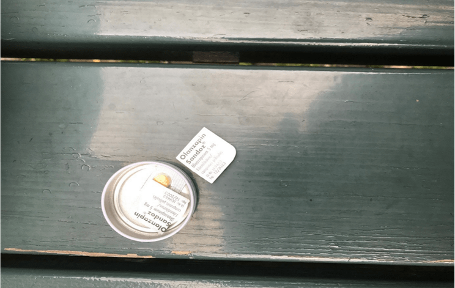
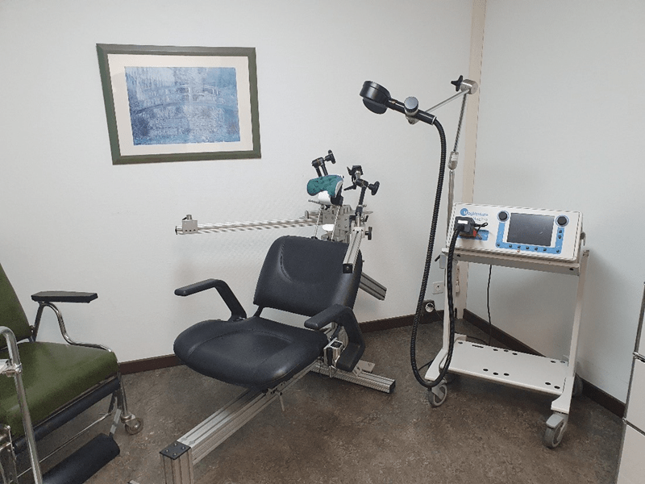

+++
title = "Anders, aber immer noch ein Mensch"
date = "2023-05-29"
draft = false
pinned = false
tags = ["Deutsch", "Reportage"]
+++


## *Schizophrenie ist eine psychische Erkrankung, die etwa 1% der Weltbevölkerung betrifft. In dieser Reportage wollen wir mit Stereotypen aufräumen und die Sicht eines Schizophrenie-Betroffenen näherbringen.*



*Eine Reportage von T. Battilana und T. Chiotelis*

Marcus, ein Betroffener, ist 48 Jahre alt und lebt in der Nähe von Bern. Schon als Jugendlicher wurde er mit Schizophrenie diagnostiziert. In einem Interview berichtete er uns über sein Leben mit Schizophrenie. Er ist vielleicht anders, aber ein Mensch ist er noch immer.

# Frühes Leben

Marcus wuchs als normales Kind auf. Er fühlte sich etwas anders und sensibler als die anderen Kinder. Es fiel ihm schwer, sich länger zu konzentrieren und wurde leicht abgelenkt. Länger ruhig sitzen war ihm schlichtweg unmöglich. Dies führte zu ungenügenden Noten. Er empfand einen hohen Leistungsdruck in der Schule. Mit seinen MitschülerInnen fühlte er sich nicht wohl. Er hatte die Rolle eines Klassenclowns.

Mit 15 Jahren begann er Cannabis und Tabak zu konsumieren und wurde süchtig. Er fühlte sich, als würde er nicht in die Welt passen. Neben seiner Lehre und Arbeit begann er mit Glücksspielen. Mit 25 stellte sein Freund fest, dass er sich stark verändert hatte. Marcus hatte Geldschulden, er war sehr manisch, handelte unüberlegt und glaubte an Verschwörungstheorien. Auf Anraten seines Freundes liess er sich in der Psychiatrie testen. Mit Hilfe eines MRT-Scans des Gehirns wurde herausgefunden, dass Marcus an Schizophrenie leidet.

An Schizophrenie erkranken nur Menschen, die die Veranlagung dazu vererbt bekommen.

Drogen, vor allem Cannabis, können das Risiko einer Schizophrenie-Erkrankung stark erhöhen. Eine stressige Situation ist häufig der eigentliche Auslöser einer Schizophrenie.

> *"Unser Gehirn ist komplex und schwierig zu verstehen. Obwohl man schon sehr viel über Ursachen und involvierte Netzwerke weiß, ist vieles noch unverstanden und Gegenstand von spezialisierter Forschung." -Dr. Tobias Bracht*

Den Eltern von Marcus war bekannt, dass in ihrer Familie bereits einige Verwandte an Schizophrenie litten. Die genetische Veranlagung ist bei Marcus vorhanden. Der hohe Cannabis-Konsum als Jugendlicher führte massgeblich zum Ausbruch der Krankheit. Marcus wuchs in einer eher linksorientierten Gemeinschaft auf. Stressige Situation erlebte Marcus durch die zahlreichen Provokationen der Neonazis in seinem Umfeld.

Schizophrenie entsteht durch ein Prozess im Gehirn, der von verschiedenen Faktoren ausgelöst wird, wie uns Herr Bracht erzählte von der Poliklinik. Ihn interviewten wir als

Fachperson zu diesem Thema. Das Gehirn besitzt tausende von Neuronen-Netzwerken, die alle einen eigenen Zweck erfüllen. Eines ist zum Beispiel für das Regulieren der Emotionen zuständig, ein anderes für die Sprache usw. Eine Schizophrenie entsteht, wenn eines dieser Netzwerke überstimuliert wird. Wird ein Netzwerk zu stark durchblutet oder besitzt es einen zu großen Sauerstoffgehalt, ergibt sich eine ungleiche Polarität zwischen den beiden Hirnhälften. Diese Überstimulierung kann dazu führen, dass dieses Netzwerk seine spezifische Aufgabe nicht erfüllen kann. Es kann passieren, dass das Netzwerk neue Informationen «erfindet».

Eine ungleichmäßige Verteilung an Botenstoffen wie z.B. Melatonin, Serotonin, Adrenalin kann ebenfalls zur Auslösung von Schizophrenie führen.

# Der Effekt

Schizophrenie kann das Verhalten eines Menschen in kürzester Zeit sehr stark verändern. Bei Marcus führen die phasenweisen Ausbrüche der Krankheit zu gravierenden Auswirkungen: Er leidet immer an Schlafstörungen, sein Redefluss ist häufig stark erhöht ist und manchmal hat er einen sehr enormen Ideenfluss. Oft befindet er sich in einem manischen Zustand, in dem er sehr aktiv ist, aber unüberlegt handelt und z.B. sinnlos Geld ausgibt. Natürlich passiert das Letztere bei vielen anderen Menschen auch.

Aus den Ungleichheiten der Polarität im Gehirn kann der Körper Positiv- und Negativ-symptome entwickeln. Die Symptome können unterschiedlich stark ausgeprägt sein, wie es bei Schwererkrankten vorkommen kann, wenn sie nicht mehr sprechen können. Als Negativsymptome bezeichnet man die Fähigkeiten, die verloren gehen und einen passiven/depressiven Zustand. Als Positivsymptome bezeichnet man Fähigkeiten und Symptome, die neu hinzukommen. Dazu zählen Stimmen im Kopf, die gar nicht da sind. Die meisten haben aber als Positivsymptome eine sehr heitere und aktive Persönlichkeit, in der sie Sachen unüberlegt machen. Negativsymptome kommen öfters bei lang erkrankten Menschen vor. Marcus hingegen zeigt nicht sehr viele Negativsymptome, eher Positivsymptome.

Etwas anderes Komisches, was er oft erlebt, ist eine Art Mischpsychose. Das heißt, dass er manchmal für sehr lange Zeit sehr positiv sein kann, und dann plötzlich sehr depressiv. Er arbeitete praktisch alles auf, er war fröhlich, um dass es innerhalb wenige Tage wieder alles auf 0 geht. Es ist wirklich nicht zu erklären, warum so etwas passiert, aber es ist interessant, darüber nachzudenken.

# Ein Tag im Leben von…

Marcus sein Tag läuft eigentlich immer sehr strukturiert ab, seitdem er nicht mehr arbeitet, das stresste ihn zu fest. Er steht am Morgen etwa um 11 Uhr auf, holt sich einen Kaffee, raucht kurz eine Zigarette und wartet bis 12 Uhr, bis sein Lieblings-Schach-YouTuber ein neues Video veröffentlicht. Nur nachdem er es geschaut hat, fühlt er sich bereit, seinen Tag zu starten. Schach ist seine absolute Leidenschaft, und er fühlt sich nicht bereit auf den Tag, ohne ein paar Partien zu spielen. Nach dem Schachspielen trifft er seinen Nachbarn auf

einen Kaffee und sie besprechen viele verschiedene Themen, aber auch vor allem Schach. Nach dem Kaffee macht er einen Spaziergang, denn er denkt, dass es seinen Geist erfrische. Er isst sein einziges Mahl um 17 Uhr. Sein Medikament braucht er zwar, um Stimmungsschwankungen zu verhindern, jedoch muss er mit dem Essen aufpassen, da sein Medikament als Nebenwirkung Übergewicht mit sich bringt. Die wichtigste Behandlungsmethode bei Schizophrenie sind fast immer Medikamente, sogenannte Antipsychotika, die gegen Psychose helfen.

Der Konsum von Antipsychotika soll jedoch mit einer Fachperson besprochen werden, da es oft viele Nebenwirkungen dazu hat. So kann z. B. sein Medikament, Olanzapin, zu massivem übergewichtig sein führen. Andere Nebenwirkungen könne, sein: sexuelle Probleme bzw. Erektionsstörungen, Bewegungsstörungen, Stoffwechselprobleme und vieles mehr. Es soll auch spezifische Ernährung geben, die bei der Schizophrenie helfen könnten, jedoch ist das nicht wissenschaftlich bewiesen.

Am späten Abend trifft er sich noch mit Freunden, oder schaut einen Fußball-Match. Zum Schluss spielt er noch genug Schach, bis er dann um etwa 11 Uhr ins Bett geht. Aber der Tag endet noch nicht. Er kann meistens erst etwa am 1 Uhr einschlafen, aufgrund seiner Schlafstörungen, die er fast sein ganzes Leben hatte. In dieser Zeit hört er noch ein paar Hörbücher, die ihn runterfahren lassen und er einschlafen kann. Sein Tag sieht fast immer so aus, was auch sehr wichtig für ihn ist, denn er hat wenig Energie zur Verfügung und muss sie genau einteilen, z.B. an welchen Tagen er Freunde trifft und am nächsten Tag sich vollständig erholt.

> *"Wenn meine Freunde fragen, ob es mir reicht, dass ich nur Schach spiele in meinem Leben, sage ich, ich bin zufrieden mit wenigen Sachen/mit dem." -Marcus* 

Auch wenn er anders von den anderen ist, ist er trotzdem ein Mensch, und wird auch so behandelt. Seine Freunde, mit denen er sehr nahe ist, akzeptieren ihn wie er ist, und haben kein Problem damit, dass er anders ist. Das ist auch ein wichtiger Aspekt zum Beachten, wenn man besser mit Leuten umgehen will, die Schizophrenie, oder irgendeine andere psychische Krankheit haben. Man soll die Person behandeln, als hätten sie nichts, als wären sie ein normaler Mensch. So fühlen Sie sich am wohlsten, meint Marcus.

# Die Behandlung

Marcus hat in seinem Leben schon sehr viele Kliniken und Psychotherapeuten besucht. Er geht alle 4 Wochen zur Psychotherapie. Er nimmt zwar schon fast sein ganzes Leben Olanzapin, und wird es auch sehr lange nehmen, jedoch war es nicht einfach, ein Medikament zu finden, welches er vertragen kann. Das wichtigste Ziel bei der Behandlung von Schizophrenie ist es, mit den Patienten zusammenzuarbeiten, zu diskutieren und die richtigen Medikamente zu finden, welche der Patient vertragen kann, also bei welchen die Nebenwirkungen am besten Verträglich sind für den Patienten. Aber nach vielen Besuchen, viele Experimente mit Medikamenten, die ihn fast ohne Stimme gelassen hätten, und nach ein paar temporären Psychosen fand er das richtige Medikament. Bevor man offiziell mit Schizophrenie diagnostiziert wird, gibt es Vorwarnungen dafür, dass man vielleicht daran leidet. Gute Hinweise darauf können Schlafstörungen und Konzentrationsstörungen sein, welche er oft als Kind hatte. Es gibt eine Zeit, die sogenannte Prodromalphase, bei der es schwierig ist, Schizophrenie in jemanden zu erkennen. Dies ist meistens bei jungen Leuten der Fall, so etwa unter 20 Jahren alt. Jedoch kann man mit Verhaltensweisen wie Aggression, Stress, unklares Denken und ein unkoordiniertes Gedächtnis bei jungen Leuten schon auf Schizophrenie herleiten. Bei ihm war es auch relativ einfach, da seine Verhaltensweise sehr ähnlich waren wie eben beschrieben.

## Andere Behandlungsmethode

Die transkranielle Magnetstimulation ist eine sehr neue Behandlungsmethode der Schizophrenie. Die transkranielle Magnetstimulation (kurz TMS) ist ein Prozess, der nur bei sehr spezifischen Arten von Schizophrenie und Depressionen angewendet wird. Dieser Prozess hilft gegen ungleiche Polarität zwischen den zwei Hirnhälften. Wenn ein Netzwerk der einen Hirnhälfte überstimuliert wird, entsteht ungleiche Polarität (Membranpotenzial) zwischen den zwei Hälften. Die Polarität der zwei Hälften regulieren sich in der Regel automatisch, heißt, wenn eine Hirnhälfte überstimuliert wird, wird die andere automatisch unterstimuliert. Bei der TMS wird eine Magnetspule an eine spezifische Stelle des Kopfes gestellt, welche durch Scans und MRTs entschieden wird. Diese Magnetspule erzeugt ein Magnetfeld, welches ein Netzwerk über- bzw. unterstimulieren kann. Dabei wird dann die Polarität so reguliert, dass in beiden Hälften schlussendlich ein Gleichgewicht herrscht.

Dr. Tobias Bracht kannte sich mit dem Thema gut aus, und mithilfe eines Experten haben sie uns das Thema sehr gut erklären können. Etwas Lustiges, was Dr. Bracht und zeigte, was man mit dem Gerät tun kann, ist eine Bewegung im Unterarm zu zwingen, indem man die richtige Stelle des Gehirns sehr kurz stimuliert. Natürlich ergibt sich kein langfristiger Effekt, wenn man es nur sehr kurz macht. Für Schizophrenie-Patienten ist es häufig empfohlen, eine repetitive TMS durchzuführen, heißt, man soll sie immer und immer machen, damit es einen permanenten Effekt hat.

Als Fazit wollen wir festhalten, dass Schizophrenie eine Krankheit mit vielen Gesichtern ist, nicht nur Stimmen hören und wir die Menschen, die davon betroffen sind, normal und mit Rücksichtnahme behandeln sollten.

