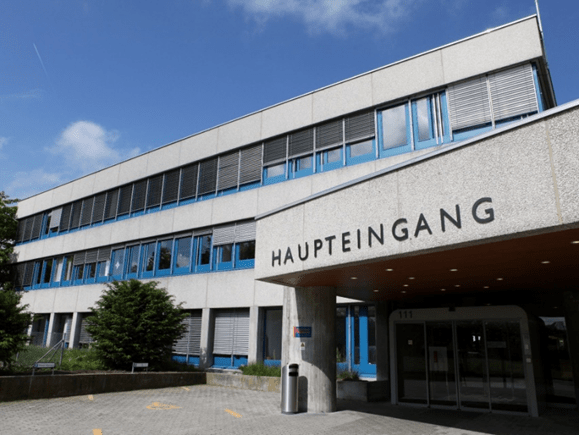

+++
title = "Anders, aber immer noch ein Mensch"
date = "2023-05-29"
draft = true
pinned = false
tags = ["#deutsch", "#reportage"]
+++


## *Schizophrenie ist eine psychische Erkrankung, die etwa 1% der ganzen Weltbevölkerung betrifft. Schizophrenie ahnt sehr einer typischen Psychose, jedoch ist sie viel umfangreicher und ein sehr grob studiertes Thema. In dieser Reportage fokussieren wir und auf das Allgemeine.*



Eine Reportage von T.Battilana und T.Chiotelis

Marcus, unser Betroffene, ist heute 48 Jahre alt und lebt in der Schweiz nahe an Bern. Schon mit jungem Alter wurde er mit Schizophrenie diagnostiziert. Er ist vielleicht anders, aber ein Mensch ist er immer noch!

# Frühes Leben

Marcus wuchs als normales Kind auf, jedoch bemerkte man schon seit jungem Alter viel Merkwürdiges. Er hatte sehr viele Probleme in der Schule, mit den Noten, aber auch mit seinem Verhalten. Er was immer recht ein Klassenclown, konnte nicht ruhig sitzen und konnte sich oft nicht sehr gut konzentrieren. Dazu entwickelte er schon als er 15 war eine sehr grosse Sucht auf Cannabis und Rauchen. Er fühlte sich, als würde er nicht in der Welt passen, und dass er anders war als alle anderen. Seine Eltern wussten auch, dass etwas mit ihrem Sohn falsch war, und ihnen war auch bekannt, dass in der Familie schon ein paar Leute Schizophrenie hatten. Und nach sehr vielen Tests und MRT-Scans fanden sie heraus, dass er es wirklich hat.

Was seine Schizophrenie verursachte, ist ihm nicht wirklich bekannt, aber es könnte an den hohen Cannabis-Konsum und das Rauchen von jungem Alter liegen.

Drogen, davon vor allem Cannabis, können das Risiko einer Schizophrenie-Erkrankung stark erhöhen. Noch ein interessanter Fakt ist, dass das Rauchen, und das Aufhören zu rauchen beide auch das Risiko erhöhen können. Es gibt uns echt ein gutes Thema zum darüber nachdenken

Es könnte der grosse Stress und Angst von der Schule und von der Arbeit sein, es könnte aber auch einfach sein, weil es schon in der Familie manche hatten. Es gibt viele Wege, wie man eine Schizophrenie erhalten kann. Aber allgemein ist das alles ein Prozess im Gehirn, der von verschiedenen Faktoren ausgelöst wird. Das Gehirn besitzt tausende, sogar Millionen an Netzwerke von verschiedenen Neuronen, die alle einen eigenen Zweck erfüllen. Eins ist zum Beispiel für das Regulieren der Emotionen zuständig, das andere für die Sprache usw. Eine Schizophrenie kann passieren, wenn einer dieser Netzwerke überstimuliert wird. Wenn ein Netzwerk zu fest durchblutet wird, oder einen zu grossen Sauerstoffgehalt hat, wird das Membranpotenzial einer Hirnhälfte stark erhöht, und ergibt eine ungleiche Polarität zwischen den zwei Hirnhälften. Diese Überstimulierung kann dazu führen, dass dieses spezifische Netzwerk eine seiner Verantwortungen nicht erfüllt, oder sogar neue erfindet. Eine andere Ursache dafür kann eine ungleichmäßige Verteilung an den benötigten Botenstoffe des Netzwerks sein. Daraus entstehen Positiv- und Negativsymptome.

> *"Unser Gehirn ist komplex und schwierig zu verstehen. Obwohl man schon sehr viel über Ursachen und involvierte Netzwerke wei*ß*, ist vieles noch unverstanden und Gegenstand von spezialisierter Forschung." -Dr. Tobias Bracht*

# Der Effekt

Schizophrenie kann bei einem Menschen sein Verhalten sehr stark ändern. Bei Marcus ist der Fall, dass er oft Schlafstörungen erlebt, sein Redefluss sehr erhöht ist, manchmal einen sehr enormen Ideenfluss hat und dass er oftmals sinnlos Geld ausgibt. Natürlich passiert das letzte bei vielen anderen, auch welche, die nicht Schizophrenie haben, jedoch die anderen nicht. Diese Sachen werden alle von der Schizophrenie ausgelöst.

Aus den Ungleichheiten der Polarität im Gehirn kann der Körper Positiv- und Negativsymptome entwickeln. Diese können nur etwas Kleines sein, aber man kann auch deswegen wichtige Fähigkeiten verlieren wie z. B. das Sprechen. Als Negativsymptome bezeichnet man die normalen Fähigkeiten, die man nach einer Schizophrenie-Erkrankung verlor. Als Positivsymptome bezeichnet man Fähigkeiten, die man neu dazu bekam. Negativsymptome kommen öfters bei lange erkrankten Menschen vor, er zeigt jedoch nicht sehr viele.

Etwas anderes Komisches, was er oft erlebt, ist eine Art Mischpsychose. Das heisst, dass er manchmal für sehr lange Zeit sehr positiv sein kann, und dann plötzlich sehr depressiv. Er arbeitete praktisch alles auf, er war fröhlich, um dass es innerhalb wenige Tage wieder alles auf 0 geht. Es ist wirklich nicht zu erklären, warum so etwas passiert, aber es ist interessant, darüber nachzudenken.

# Ein Tag im Leben von…

Marcus sein Tag läuft eigentlich immer sehr ähnlich, seitdem er nicht mehr arbeitet, das stresste ihn zu fest. Er steht am Morgen etwa um 11 Uhr auf, holt sich ein Kaffee, raucht kurz eine Zigarette, und wartet bis 12 Uhr, die Zeit, an der sein Lieblings-Schach-YouTuber ein neues Video veröffentlicht. Nur nachdem er es geschaut hat, fühlt er sich bereit, seinen Tag zu starten. Schach ist seine absolute Leidenschaft, und er fühlt sich nicht bereit auf den Tag, ohne ein paar Partien zu spielen. Nach dem Schachspielen trifft er seinen Kollegen aus seiner WG für einen Kaffee, und sie besprechen viele verschiedene Themen, aber auch vor allem Schach. Nach dem Kaffee macht er einen Spaziergang, denn er denkt, dass es seinen Geist erfrische. Er isst sein einziges Mahl um 17 Uhr. Sein Medikament braucht er zwar, um Stimmungsschwankungen zu verhindern, jedoch muss er mit dem Essen aufpassen, da sein Medikament das grosse Risiko von Übergewichtigkeit bringen.

Medikamente wie Antipsychotika sind wahrscheinlich die risikofreiste Methode, Schizophrenie zu behandeln, bzw. zu stoppen. Der Konsum von Antipsychotika soll jedoch mit einer Fachperson besprochen werden, da es oft viele Nebenwirkungen dazu hat. So kann z. B. sein Medikament, Olanzapin, zu massivem übergewichtig sein führen. Andere Nebenwirkungen könne, sein: sexuelle Probleme bzw. Erektionsstörungen, Bewegungsstörungen, Stoffwechselprobleme und viele viele mehr. Es gibt auch spezifische Nahrung, die bei der Schizophrenie helfen kann, jedoch ist das Thema noch nicht sehr genau studiert, und Marcus muss sich ja sowieso mit der Ernährung aufpassen, also ist es auch für ihn kein großes Thema.

Am späten Abend trifft er sich noch mit Freunden, oder schaut einen Fussball-Match. Zum Schluss spielt er noch genug Schach, bis er dann um etwa 11 Uhr ins Bett geht. Aber der Tag endet noch nicht. Er kann meistens erst etwa am 1 Uhr einschlafen, aufgrund seiner Schlafstörungen, die er fast sein ganzes Leben hatte. In dieser Zeit hört er noch ein paar Hörbücher, die ihn dann müde machen. Sein Tag sieht fast immer so aus, was auch ein Effekt der Schizophrenie sein könnte. Das repetitive Verhalten ist nicht sehr selten in einem Schizophrenie-Patienten. 

> *"Wenn meine Freunde fragen, ob es mir reicht, dass ich nur Schach spiele in meinem Leben, sage ich, ich bin zufrieden mit wenigen Sachen/mit dem." -Marcus* 

Auch wenn er anders von den anderen ist, ist er trotzdem ein Mensch, und wird auch so behandelt. Seine Freunde, mit denen er sehr nahe ist, akzeptieren ihn für wer er ist, und haben kein Problem damit, dass er anders ist. Das ist auch ein wichtiger Aspekt zum Beachten, wenn man besser mit Leuten umgehen will, die Schizophrenie, oder irgendeine andere psychische Krankheit haben. Man soll die Person behandeln, als hätten sie nichts, als wären sie ein normaler Mensch. So fühlen Sie sich am wohlsten.

# Die Behandlung

Marcus hat in seinem Leben schon sehr viele Kliniken und Psychotherapeuten besucht. Und er geht immer noch etwa jede 4 Monate zur Psychotherapie. Er nimmt zwar schon fast sein ganzes Leben Olanzapin, und wird es auch sehr lange nehmen, jedoch war es nicht einfach, ein Medikament zu finden, welches der Patient ertragen kann. Das wichtigste Ziel bei der Behandlung von Schizophrenie ist es, mit den Patienten zusammenzuarbeiten, zu diskutieren und die richtigen Medikamente zu finden, welche der Patient ertragen kann. Aber nach vielen Besuchen, viele Experimente mit Medikamenten, die ihn fast ohne Zunge gelassen hätten, und nach ein paar temporären Psychosen fand er das richtige Medikament. Bevor man offiziell mit Schizophrenie diagnostiziert wird, gibt es Vorwarnungen dafür, dass man vielleicht daran leidet. Gute Hinweise darauf können Schlafstörungen und Konzentrationsstörungen sein, welche er oft als Kind hatte. Es gibt eine Zeit, die sogenannte Prodromalphase, bei der es schwierig ist, Schizophrenie in jemanden zu erkennen. Dies ist meistens bei jungen Leuten der Fall, so etwa unter 20 Jahren alt. Jedoch kann man mit Verhaltensweisen wie Aggression, Stress, unklares Denken und ein unkoordiniertes Gedächtnis bei jungen Leuten schon auf Schizophrenie herleiten. Bei ihm war es auch relativ einfach, da seine Verhaltensweise sehr ähnlich wie beschrieben war. 

## Andere Behandlungsmethode

Die transkranielle Magnetstimulation ist eine der wohl berühmtesten Behandlungsmethoden der Schizophrenie. Die transkranielle Magnetstimulation (kurz TMS) ist ein Prozess, der nur bei sehr spezifischen Arten von Schizophrenie und Depressionen angewendet wird. Dieser Prozess hilft gegen ungleiche Polarität zwischen den zwei Hirnhälften. Wenn ein Netzwerk der einen Hirnhälfte überstimuliert wird, entsteht ungleiche Polarität (Membranpotenzial) zwischen den zwei Hälften. Die Polarität der zwei Hälften regulieren sich in der Regel automatisch, heisst, wenn eine Hirnhälfte überstimuliert wird, wird die andere automatisch unterstimuliert. Bei der TMS wird eine Magnetspule an eine spezifische Stelle des Kopfes gestellt, welche durch Scans und MRTs entschieden wird. Diese Magnetspule erzeugt ein Magnetfeld, welches ein Netzwerk über- bzw. unterstimulieren kann. Dabei wird dann die Polarität so reguliert, dass in beiden Hälften schlussendlich ein Gleichgewicht herrscht.

Dr. Tobias Bracht kannte sich mit dem Thema gut aus, und mithilfe eines Experten haben sie uns das Thema sehr gut erklären können. Etwas Lustiges, was Dr. Bracht und zeigte, was man mit dem Gerät tun kann, ist eine Bewegung im Unterarm zu zwingen, indem man die richtige Stelle des Gehirns sehr kurz stimuliert. Natürlich ergibt sich kein langfristiger Effekt, wenn man es nur sehr kurz macht. Für Schizophrenie-Patienten ist es häufig empfohlen, eine repetitive TMS durchzuführen, heißt, man soll sie immer und immer machen, damit es einen permanenten Effekt hat.